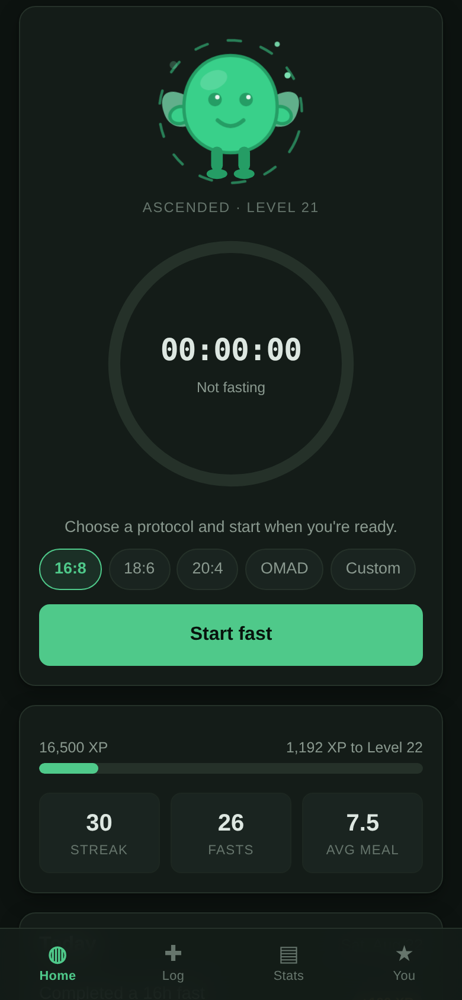
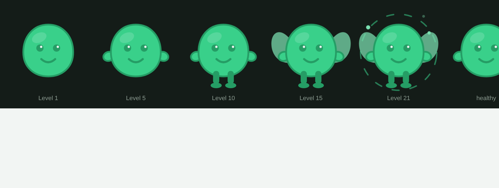

# FastQuest

A gamified intermittent-fasting and eating tracker. Hold a fast, log what you ate, level
up a creature that grows as you go.

No build step, no framework, no backend, no account. It's a static progressive web app
you install to your phone's home screen, and every byte of your data stays in your own
browser.



## What it does

**Fasting.** Start a fast, pick a protocol — 16:8, 18:6, 20:4, OMAD, or a custom
12–24h — and a ring counts you down. The timer is derived from timestamps, not an
accumulating counter, so closing the app, locking your phone or rebooting mid-fast
doesn't disturb it.

**Eating.** Logging a meal is tapping chips: *protein*, *vegetables*, *fried*,
*sugary drink*, and so on. Those produce a 0–10 score. There's no food database to
search and nothing to weigh, because the version you'll actually still be using in
March beats the accurate one you quit in January. Calories and protein are available
behind an optional "Add details" disclosure if you want them.

**The game.** Fasts and meals both earn XP. Consecutive days build a streak that
multiplies fast XP up to 1.5×. XP drives levels, levels drive your creature, which
evolves through five stages and visibly droops when a streak lapses. Twelve badges
mark the milestones.

| Stage | Level | Gains |
|---|---|---|
| Blob | 1 | body and eyes |
| Sprout | 5 | stubby limbs |
| Runner | 10 | legs, taller stance |
| Winged | 15 | wings |
| Ascended | 20 | aura and sparks |



## How the scoring works

Everything below lives in [`engine.js`](engine.js) as pure functions, and is covered by
[`../test/engine.test.mjs`](../test/engine.test.mjs).

**Meals** start at a neutral 5. Good tags add (protein and vegetables +2; fruit, whole
grain, legumes/nuts, water, home-cooked +1), poor ones subtract (fried, sugary drink,
dessert, ultra-processed −2; oversized portion, late night −1). The result is clamped
to 0–10 and pays `score × 3` XP.

**Fasts** pay `target hours × 6` for reaching the target, plus 2 XP per extra 15
minutes up to a +40 cap. Ending early pays half credit scaled by how far you got.
The whole thing is then multiplied by your streak.

**Levels** need `100 × (n−1)^1.7` lifetime XP, so level 2 is 100 XP, level 5 is 1,049,
and level 20 is 14,913. A completed 16:8 fast is 96 XP.

## The guardrails

A fasting app can quietly turn into a machine that rewards eating less. This one is
built so it can't:

- **XP is hard-capped at 24 hours.** A 30-hour fast earns exactly what a 24-hour one
  does. There's no leaderboard and no longest-fast record to chase.
- **No calorie target, and no deficit mechanic.** Calories are recorded and charted if
  you enter them, never scored.
- **Ending early still earns XP.** Honesty must never cost you points, or you'll stop
  logging — which defeats the entire purpose.
- **No meal can lose you XP.** A bad meal scores low; it never goes negative. Logging
  an honest bad meal always beats hiding it.
- **No XP for skipping meals.**

> **Not medical advice.** Talk to a doctor before starting intermittent fasting —
> especially if you are pregnant or breastfeeding, take medication for diabetes or
> blood pressure, are under 18, or have any history of disordered eating. If a fast
> makes you feel faint or unwell, end it and eat.

## Your data

Everything is a single `localStorage` key (`fastquest.v1`) in whichever browser you use.
Nothing is uploaded, there's no account, and no server ever sees it.

The flip side: clearing site data wipes your history, and it doesn't follow you between
devices. **You → Export JSON** writes a backup file; **Import JSON** restores one, badges
included. Worth doing occasionally.

## Installing it

Served over HTTPS (GitHub Pages works), FastQuest is installable:

- **iOS** — open it in Safari, Share → *Add to Home Screen*.
- **Android** — Chrome offers *Install app*, or use ⋮ → *Add to Home screen*.

Once installed it runs fullscreen with its own icon and works with no network at all.

To turn on hosting for this repo: **Settings → Pages → Deploy from a branch → `main`**,
then visit `https://<user>.github.io/hello-world/fastquest/`.

## Running it locally

A service worker and ES modules both need a real origin, so `file://` won't do:

```sh
python3 -m http.server 8000     # from the repo root
# then open http://localhost:8000/fastquest/
```

## Development

```sh
node --test test/engine.test.mjs      # scoring, levels, streaks, badges
python3 fastquest/tools/make-icons.py # regenerate PWA icons after changing the mark
```

| File | Purpose |
|---|---|
| `engine.js` | All scoring logic. Pure functions — no DOM, storage or clock reads |
| `app.js` | State, `localStorage`, rendering, events, SVG charts |
| `creature.js` | The evolving avatar |
| `app.css` | Theme tokens and layout |
| `sw.js` | Offline app-shell cache — bump `CACHE_VERSION` when shell files change |
| `tools/make-icons.py` | Draws the PNG icons with only the standard library |

The split matters: because `engine.js` never touches the DOM, every scoring rule above
is testable without a browser, and `test/engine.test.mjs` covers the XP cap, streak
rollover across missed days and DST boundaries, level thresholds, and each badge.
